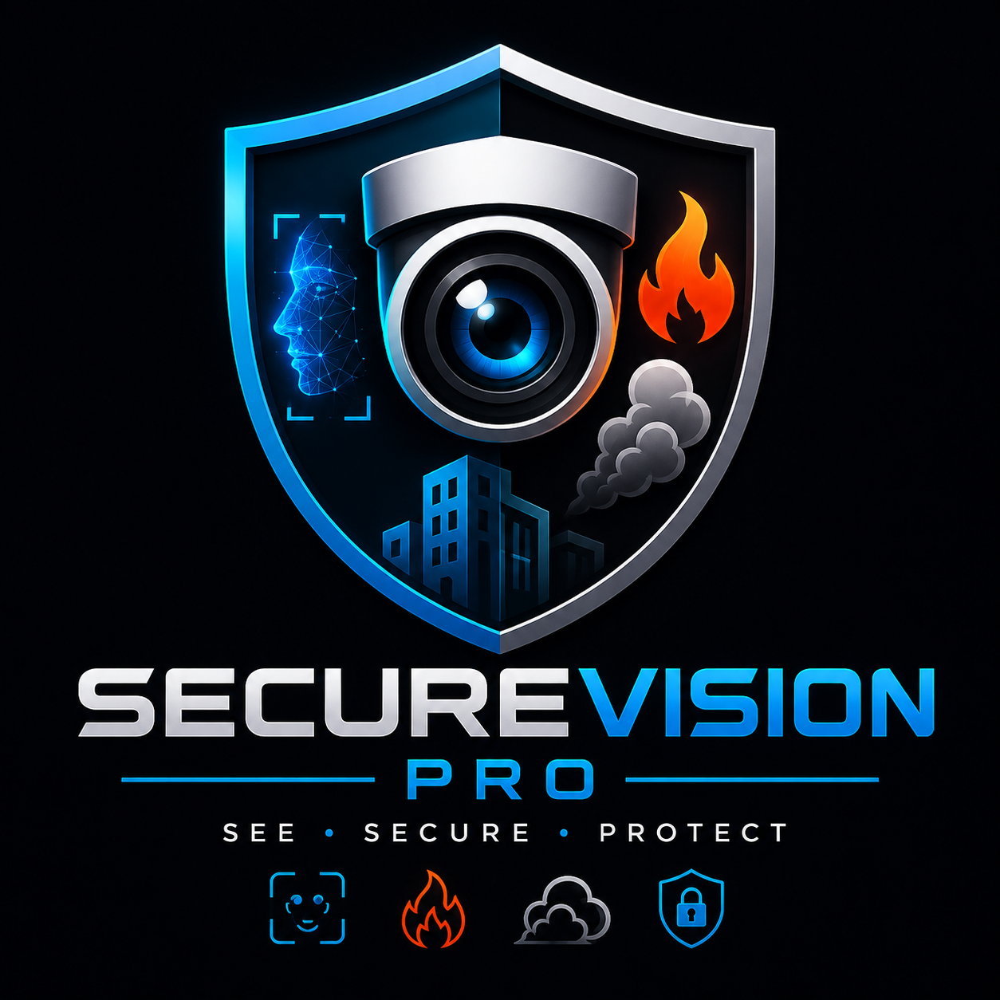

<div align="center">

<!-- Project logo placeholder — replace with your actual logo -->


# 🛡️ SecureVision Pro

### AI-Powered Intelligent Surveillance and Attendance Platform

[](https://www.python.org/)
[](https://flask.palletsprojects.com/)
[](https://opencv.org/)
[](https://github.com/ultralytics/ultralytics)
[](https://www.sqlite.org/)
[](https://www.docker.com/)
[](LICENSE)
[](https://github.com/Shlokverma0/face-attendance-recognition-system/stargazers)
[](https://github.com/Shlokverma0/face-attendance-recognition-system/commits/main)

**Developed by:** SHLOK VERMA & ARPIT TYAGI — *AI/ML Engineers*

</div>

---

## 📖 Table of Contents

- [About](#-about)
- [Features](#-features)
- [Tech Stack](#️-tech-stack)
- [Screenshots](#-screenshots)
- [Architecture](#-architecture)
- [Project Structure](#-project-structure)
- [Setup](#️-setup)
- [Testing Fire & Smoke Detection](#-testing-fire--smoke-detection)
- [Security Notes](#-security-notes)
- [Roadmap](#️-roadmap)
- [Contributors](#-contributors)
- [Contributing](#-contributing)
- [License](#-license)

---

## 🧭 About

**SecureVision Pro** is an enterprise-grade AI surveillance and attendance platform that unifies multiple intelligent monitoring capabilities into a single, cohesive system. It brings together **facial recognition attendance tracking**, **fire and smoke detection**, **after-hours intrusion monitoring**, and a **unified real-time event management dashboard** — all wrapped in a clean, extensible Flask architecture.

Built for organizations that need more than a single-purpose tool, SecureVision Pro combines:

- 🎯 **Facial Recognition** — automated, liveness-verified entry/exit tracking
- 🔥 **Fire Detection** — real-time flame recognition via YOLOv8
- 💨 **Smoke Detection** — independent smoke-class detection with its own confidence tuning
- 🛰️ **Event Management** — a single unified timeline correlating every alert and milestone
- 📣 **Alerting System** — instant Email, SMS, and WhatsApp notifications on critical events
- 📊 **Dashboard Analytics** — live statistics, historical logs, and exportable attendance records

The result is a platform that looks and behaves like a genuine enterprise security product — not a single-purpose student project.

---

## ✨ Features

### 👤 Face Recognition Attendance
- Automatic entry/exit marking via webcam, with duplicate-face registration checks
- **Blink-based liveness detection** (Eye Aspect Ratio) to block photo/screen spoofing
- Cooldown logic to prevent duplicate entry/exit toggling
- RTSP mobile-camera support for a dedicated exit-only feed
- Excel export of full attendance history

### 🔥 Fire & Smoke Detection
- YOLOv8 model detecting both **fire** and **smoke** as separate classes
- Independent, tunable confidence thresholds per class (`FIRE_CONF_THRESHOLD`, `SMOKE_CONF_THRESHOLD`)
- Color-coded bounding boxes on snapshots (red = fire, amber = smoke)
- Cooldown + reset-gap logic to avoid alert spam during a sustained event
- Dashboard test-mode buttons for both fire and smoke detection

### ⚠️ After-Hours Intrusion Detection
- Configurable restricted time window (`RESTRICTED_START` / `RESTRICTED_END`)
- Logs and alerts on any person detected during that window
- Supports open-ended and overnight windows

### 🛰️ Unified Live Events Feed
- Single real-time timeline combining fire/smoke, after-hours, and attendance events
- Filterable by type and severity, auto-refreshing dashboard panel
- Lightweight `events` table indexing the detailed source tables

### 📣 Multi-Channel Alerting
- Email alerts via Resend or SendGrid
- SMS and WhatsApp alerts via Twilio
- All external alerts dispatched asynchronously so they never block detection

---

## 🛠️ Tech Stack

| Layer | Technology |
|---|---|
| Backend | Flask (Python) |
| Face Recognition | `face_recognition` (dlib-based) |
| Fire/Smoke Detection | YOLOv8 (Ultralytics) |
| Database | SQLite |
| Camera Ingest | OpenCV, RTSP |
| Alerting | Resend / SendGrid, Twilio |
| Frontend | HTML, CSS, vanilla JS |

---

## 📸 Screenshots

> Replace the placeholders below with real screenshots stored in a `screenshots/` folder at the project root.

### Login Page


---

### Dashboard


---

### Attendance Monitoring


---

### Fire Detection


---

### Smoke Detection


---

### Event Feed


---

## 🏛️ Architecture

```text
Camera
   │
   ▼
OpenCV
   │
   ▼
YOLOv8
   │
   ▼
SecureVision Pro Core
   │
   ├── Face Recognition
   ├── Fire Detection
   ├── Smoke Detection
   ├── Event Manager
   ├── Alerts
   └── Dashboard
```

---

## 📁 Project Structure

```
face-attendance-recognition-system/
│
├── app.py                          # Main Flask application
├── events.py                       # Unified event logging module
├── database.db                     # SQLite database
├── requirements.txt
├── Dockerfile
├── .env                             # Environment configuration (not committed)
│
├── models/
│   └── best.pt                     # YOLOv8 fire/smoke detection weights
│
├── templates/
│   ├── base.html
│   ├── index.html
│   ├── login.html
│   ├── register.html
│   ├── mark_attendance.html
│   ├── mark_exit.html
│   ├── dashboard.html
│   └── dashboard/
│       └── _events_feed.html       # Live events panel (included in dashboard)
│
└── static/
    ├── style.css
    ├── events.css
    ├── script.js
    ├── attendance.js
    ├── exit.js
    └── events.js
```

---

## ⚙️ Setup

### 1. Clone and create a virtual environment
```bash
git clone <repo-url>
cd face-attendance-recognition-system
python -m venv venv
venv\Scripts\activate        # Windows
source venv/bin/activate     # macOS/Linux
```

### 2. Install dependencies
```bash
pip install -r requirements.txt
```

### 3. Configure environment variables
Create a `.env` file in the project root (same folder as `app.py`) with the settings you need:

```env
APP_NAME=SecureVision Pro
APP_DESCRIPTION=AI-powered surveillance and attendance platform

# Fire/Smoke detection thresholds
FIRE_CONF_THRESHOLD=0.50
SMOKE_CONF_THRESHOLD=0.45

# After-hours restricted window
RESTRICTED_START=18:00
RESTRICTED_END=07:00

# Email alerts (choose one provider)
ALERT_EMAIL=you@example.com
RESEND_API_KEY=
SENDGRID_API_KEY=

# SMS/WhatsApp alerts (Twilio)
ALERT_PHONE=+91XXXXXXXXXX
TWILIO_ACCOUNT_SID=
TWILIO_AUTH_TOKEN=
TWILIO_PHONE_NUMBER=
TWILIO_WHATSAPP_NUMBER=whatsapp:+14155238886
```

> ⚠️ Save `.env` as plain **UTF-8** (not UTF-16, not "UTF-8 with BOM"). Most editors default to UTF-8 automatically, but double-check via your editor's encoding indicator if you hit a `UnicodeDecodeError` on startup.

### 4. Run the application
```bash
python app.py
```
The app will be available at `http://127.0.0.1:5000/`.

**Default admin login:** `ADMIN` / `ADMIN` — change this before deploying anywhere beyond local testing.

---

## 🧪 Testing Fire & Smoke Detection

1. Place a test image at the project root:
   - `test_fire.jpg` (or `test_fire_clear.jpg`) for fire detection
   - `test_smoke.jpg` for smoke detection
2. Open the **Dashboard** and use the **"🔥 Run Fire Test"** or **"💨 Run Smoke Test"** buttons.
3. Detections are logged to the database and appear in the **Live Events Feed**.

---

## 🔒 Security Notes

This project is functional for demos and small deployments, but before any production/public-facing use, address:
- Replace the hardcoded admin credentials with proper hashed-password user accounts
- Set a strong, environment-provided `SECRET_KEY` instead of the hardcoded one
- Disable Flask debug mode (`debug=False`) in production
- Add CSRF protection and login rate-limiting
- Consider migrating from SQLite to PostgreSQL for multi-camera/multi-site deployments

---

## 🗺️ Roadmap

- [ ] Multi-camera support
- [ ] Cloud deployment
- [ ] Docker support
- [ ] Kubernetes deployment
- [ ] PostgreSQL migration
- [ ] Edge AI support
- [ ] Mobile application
- [ ] Advanced analytics

---

## 👨‍💻 Contributors

| Name | Position |
|------|------|
| SHLOK VERMA | AI/ML Engineer |
| ARPIT TYAGI | Full-Stack Developer |

---

## 🤝 Contributing

Contributions are welcome! To get started:

1. **Fork** this repository
2. **Clone** your fork locally
   ```bash
   git clone https://github.com/your-username/securevision-pro.git
   ```
3. **Create a feature branch**
   ```bash
   git checkout -b feature/your-feature-name
   ```
4. **Make your changes** and commit with a clear message
   ```bash
   git commit -m "Add: brief description of your change"
   ```
5. **Push** to your fork and open a **Pull Request** against the `main` branch
6. Please ensure your changes don't break existing functionality (attendance, detection, or alerting) and include relevant testing notes in your PR description

For major changes, please open an issue first to discuss what you'd like to change.

---

## 📄 License

Internal / educational project. Add a license here if distributing publicly (e.g. MIT, Apache 2.0, or a proprietary license).

---

<div align="center">

Built with ❤️ by **SHLOK VERMA** and **ARPIT TYAGI**.

**SecureVision Pro © 2026**

</div>
